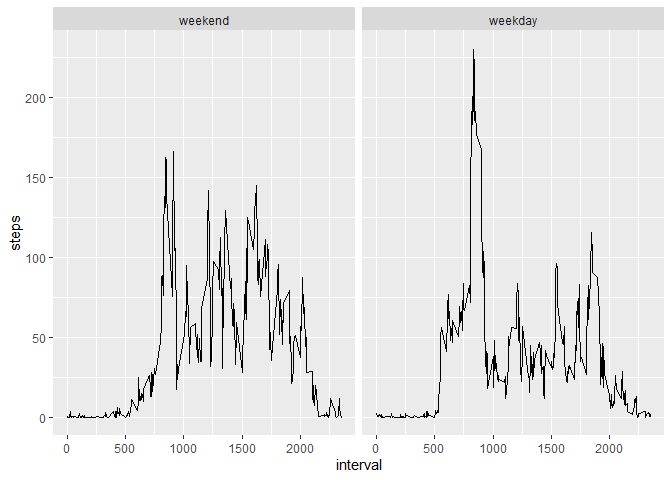

## Loaded required packages


```r
library(xtable)
library(dplyr)
```

```
## 
## Attaching package: 'dplyr'
```

```
## The following objects are masked from 'package:stats':
## 
##     filter, lag
```

```
## The following objects are masked from 'package:base':
## 
##     intersect, setdiff, setequal, union
```

```r
library(lubridate)
```

```
## 
## Attaching package: 'lubridate'
```

```
## The following objects are masked from 'package:base':
## 
##     date, intersect, setdiff, union
```

```r
library(ggplot2)
```

## Loading and preprocessing the data

Loaded data into dataframe. 

Processed the data by removing NA values into a format suitable for the analysis.


```r
activity <- read.csv(file="C:/Users/dooratharsini/Desktop/Coursera/Course5/RepData_PeerAssessment1/activity/activity.csv")
#colnames(anyNA(activity))
activity_processed <- activity[!(is.na(activity$steps)),]
activity_processed$date <- as.Date(activity_processed$date,"%Y-%m-%d")
dim(activity_processed)
```

```
## [1] 15264     3
```

And here's the first 6 rows of pre-processed dataframe.


```r
head(activity_processed)
```

```
##     steps       date interval
## 289     0 2012-10-02        0
## 290     0 2012-10-02        5
## 291     0 2012-10-02       10
## 292     0 2012-10-02       15
## 293     0 2012-10-02       20
## 294     0 2012-10-02       25
```


## What is mean total number of steps taken per day?

Calculated the total number of steps taken per day


```r
aggregate_table <- aggregate(steps ~ date, data = activity_processed, FUN=sum, na.rm=TRUE)
aggregate_table
```

```
##          date steps
## 1  2012-10-02   126
## 2  2012-10-03 11352
## 3  2012-10-04 12116
## 4  2012-10-05 13294
## 5  2012-10-06 15420
## 6  2012-10-07 11015
## 7  2012-10-09 12811
## 8  2012-10-10  9900
## 9  2012-10-11 10304
## 10 2012-10-12 17382
## 11 2012-10-13 12426
## 12 2012-10-14 15098
## 13 2012-10-15 10139
## 14 2012-10-16 15084
## 15 2012-10-17 13452
## 16 2012-10-18 10056
## 17 2012-10-19 11829
## 18 2012-10-20 10395
## 19 2012-10-21  8821
## 20 2012-10-22 13460
## 21 2012-10-23  8918
## 22 2012-10-24  8355
## 23 2012-10-25  2492
## 24 2012-10-26  6778
## 25 2012-10-27 10119
## 26 2012-10-28 11458
## 27 2012-10-29  5018
## 28 2012-10-30  9819
## 29 2012-10-31 15414
## 30 2012-11-02 10600
## 31 2012-11-03 10571
## 32 2012-11-05 10439
## 33 2012-11-06  8334
## 34 2012-11-07 12883
## 35 2012-11-08  3219
## 36 2012-11-11 12608
## 37 2012-11-12 10765
## 38 2012-11-13  7336
## 39 2012-11-15    41
## 40 2012-11-16  5441
## 41 2012-11-17 14339
## 42 2012-11-18 15110
## 43 2012-11-19  8841
## 44 2012-11-20  4472
## 45 2012-11-21 12787
## 46 2012-11-22 20427
## 47 2012-11-23 21194
## 48 2012-11-24 14478
## 49 2012-11-25 11834
## 50 2012-11-26 11162
## 51 2012-11-27 13646
## 52 2012-11-28 10183
## 53 2012-11-29  7047
```

The histogram of the total number of steps taken each day :


```r
xt <- xtable(aggregate_table)
hist(xt$steps)
```

<!-- -->

The mean and median of the total number of steps taken per day given in the below table :


```r
summary(aggregate_table$steps)
```

```
##    Min. 1st Qu.  Median    Mean 3rd Qu.    Max. 
##      41    8841   10765   10766   13294   21194
```

## What is the average daily activity pattern?

Plotted time series of the 5-minute interval (x-axis) and the average number of steps taken, averaged across all days (y-axis):


```r
average_daily_activity_pattern <- aggregate(steps ~ interval, data = activity_processed, FUN=mean)
with(average_daily_activity_pattern,plot(interval,steps,type = "l"))
```

<!-- -->

Question :
Which 5-minute interval, on average across all the days in the dataset, contains the maximum number of steps?


```r
max_steps <- average_daily_activity_pattern[average_daily_activity_pattern$steps== max(average_daily_activity_pattern$steps),]
max_steps$interval
```

```
## [1] 835
```

Answer : 
On average across all the days in the dataset, 835 5-minute interval contains the maximum number of steps

## Imputing missing values

Calculated the total number of missing values in the dataset (i.e. the total number of rows with NAs) 


```r
sum(is.na(activity$steps))
```

```
## [1] 2304
```

### Strategy to fill missing values

The mean for that 5-minute interval taken as a strategy for filling in all of the missing values in the dataset.

Above strategy was devised, since the mean/median for that day not available to fill the missing values for that particular days(days with NAs).

Created a new dataset that is equal to the original dataset but with the missing data filled in.


```r
activity_imputed <- activity %>%
  group_by(interval) %>% 
  mutate(steps = ifelse(is.na(steps), round(mean(steps, na.rm = TRUE),0), steps))
dim(activity_imputed)
```

```
## [1] 17568     3
```


And here's the few records from imputed activity data set:


```r
head(activity_imputed)
```

```
## # A tibble: 6 x 3
## # Groups:   interval [6]
##   steps date       interval
##   <dbl> <chr>         <int>
## 1     2 2012-10-01        0
## 2     0 2012-10-01        5
## 3     0 2012-10-01       10
## 4     0 2012-10-01       15
## 5     0 2012-10-01       20
## 6     2 2012-10-01       25
```

Plotted histogram of the total number of steps taken each day :


```r
aggregate_imputed <- aggregate(steps ~ date, data = activity_imputed, FUN=sum)
aggregate_imputed <- xtable(aggregate_imputed)
hist(aggregate_imputed$steps)
```

<!-- -->

Calculated the mean and median total number of steps taken per day:


```r
summary(aggregate_imputed$steps)
```

```
##    Min. 1st Qu.  Median    Mean 3rd Qu.    Max. 
##      41    9819   10762   10766   12811   21194
```

Question:
Do these values differ from the estimates from the first part of the assignment? What is the impact of imputing missing data on the estimates of the total daily number of steps?

Answer:
No, Impute using the mean for the 5-minute interval preserves the mean from the first part of the assignment.

Before imputation:

```
##    Min. 1st Qu.  Median    Mean 3rd Qu.    Max. 
##      41    8841   10765   10766   13294   21194
```
After imputation:

```
##    Min. 1st Qu.  Median    Mean 3rd Qu.    Max. 
##      41    9819   10762   10766   12811   21194
```

#### Both, before and after imputation, data follow normal distribution.

#### Since we impute with the mean of the data, the overall mean does not change, for this numerical data.


## Are there differences in activity patterns between weekdays and weekends?

Created a new factor variable in the dataset with two levels – “weekday” and “weekend” indicating whether a given date is a weekday or weekend day.


```r
activity_imputed$wDay <- factor(weekdays(as.Date(activity_imputed$date,"%Y-%m-%d")) %in% c("Saturday","Sunday"), levels=c(TRUE, FALSE), labels=c('weekend', 'weekday') )
str(activity_imputed$wDay)
```

```
##  Factor w/ 2 levels "weekend","weekday": 2 2 2 2 2 2 2 2 2 2 ...
```

A panel plot containing a time series plot of the 5-minute interval (x-axis) and the average number of steps taken, averaged across all weekday days or weekend days (y-axis). 


```r
par(mfrow=c(1,2))
activity_imputed_pattern <- aggregate(steps ~ interval+wDay, data = activity_imputed, FUN=mean)
g <- ggplot(activity_imputed_pattern, aes(x=interval, y=steps))+geom_line()+facet_grid(~wDay)
g
```

<!-- -->

